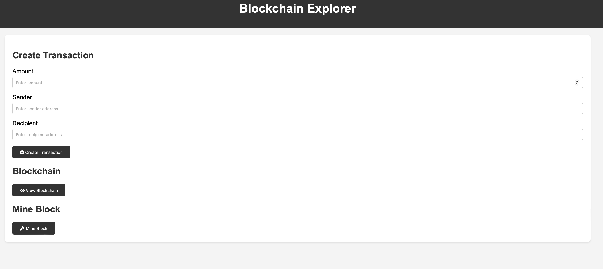

# Blockchain Exploration



Welcome to the Blockchain Exploration project! This repository provides a foundational implementation of a blockchain concept, including a frontend interface and a backend server.

## Getting Started

Follow the steps below to set up and run the project locally.

### Prerequisites

Make sure you have the following installed on your system:

- **Node.js**: Ensure Node.js is installed. You can download it from [Node.js Official Website](https://nodejs.org/).
- **npm (Node Package Manager)**: Comes pre-installed with Node.js.

### Installation Steps

1. **Clone the Repository**:

   ```bash
   git clone https://github.com/Ramseyxlil/blockchain-exploration.git
   cd blockchain-exploration
   ```

2. **Install Dependencies**:

   Run the following command to install all required dependencies listed in the `package.json` file:

   ```bash
   npm install
   ```

   Dependencies installed include:
   - `body-parser`
   - `cors`
   - `express`
   - `nodemon`
   - `request`
   - `request-promise`
   - `sha256`
   - `uuid`

### Running the Server

1. **Start the Express Server**:

   Use the following command to start the backend server:

   ```bash
   npm run node_1
   ```

   The server should start successfully and will be ready to handle requests.

### Running the Frontend

1. **Locate the Frontend File**:

   In the root directory, you will find an HTML file named `frontend.html`.

2. **Run the Frontend**:

   Open the `frontend.html` file using a live server extension or serve it using any static file server of your choice. For example, if you are using VS Code:

   - Right-click on `frontend.html` and select **"Open with Live Server"**.

   The frontend will now be live and connected to the backend server.

## Project Overview

- This project demonstrates basic blockchain functionality.
- The backend server is built using Express.js, and the frontend connects seamlessly to it.

Feel free to explore and modify the code to understand how blockchain concepts are implemented.

---

Happy coding! 🎉
